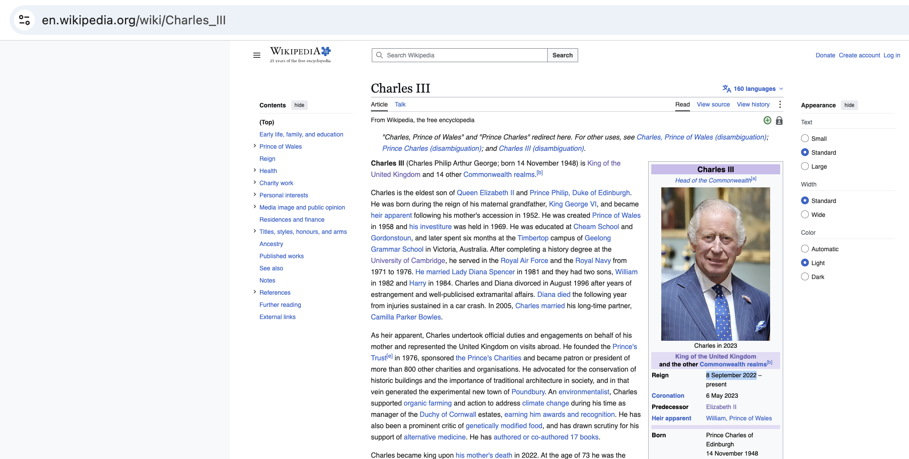
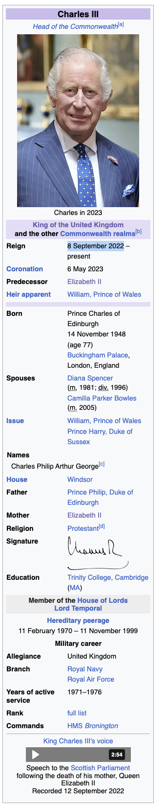

The purpose of this project is create new media using certain data in Wikipedia.

Initially the goal is simple. We want to build up a list of data entries about certain lines of sovereigns of the United Kingdom

We will start with the most recent one:
Regnal name: Charles III
Slug title: kings_of_the_united_kingdom

https://en.wikipedia.org/wiki/Charles_III

These images reflect the structure of the page to be parsed.

From this we want to do things
1. Parse the information in the Infobox and write it to a simply-formatted, concise Markdown text document.
The content should be everything inside the infobox.
The file should be written to: ./output/{slug title}/documents/{YYYY-MM-DD of start of reign}-{regnal name all caps with blanks replaced by underscores}-INFOBOX.md.

For our example:
./output/kings_of_the_united_kingdom/documents/2022-09-08-CHARLES_III-INFOBOX.md

We also want to save the thumbnail of the profile image in whatever format it comes in (typically jpeg), and use the appropriate file ening:

./output/kings_of_the_united_kingdom/images/2022-09-08-CHARLES_III

In the markdown document:

We also want to put a link to the thumbnail image. We have saved.