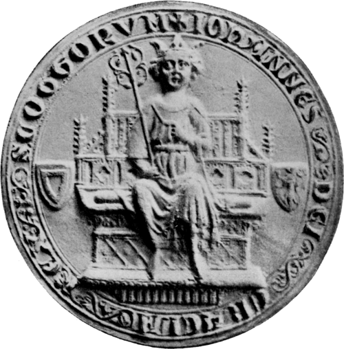

# John Balliol

- **Name**: John Balliol
- **Succession**: King of Scots
- **Image**: John, King of Scotland (seal).png
- **Caption**: Seal of King John
- **Reign**: 17 November 1292 –; 10 July 1296
- **Coronation**: 30 November 1292
- **Cor Type**: Inauguration
- **Predecessor**: Margaret (1290)
- **Successor**: Robert I (1306)
- **Spouse**: Isabella de Warenne
- **Issue**: Edward Balliol
- **House**: Balliol
- **Father**: John I de Balliol
- **Mother**: Dervorguilla of Galloway
- **Death Date**: late 1314 (aged around 65)
- **Death Place**: Château de Hélicourt, Picardy, France
- **Burial Place**: prob. Hélicourt
