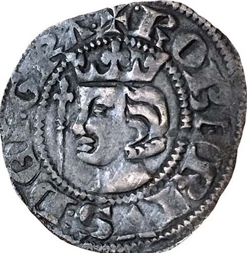

# Robert the Bruce

- **Name**: Robert I
- **Succession**: King of Scots
- **Image**: Medieval coin, Penny of Robert the Bruce (FindID 961323-1097387) Cropped.jpg
- **Caption**: Robert the Bruce on a penny,
- **Reign**: 25 March 1306 – 7 June 1329
- **Coronation**: 25 March 1306
- **Cor Type**: Inauguration
- **Predecessor**: John (1296)
- **Successor**: David II
- **Spouses**: Isabella of Mar (1296–1296); Elizabeth de Burgh (1302–1327)
- **Issue**: Marjorie Bruce; David II of Scotland; Elizabeth Bruce; Illegitimate:; Robert Bruce, Lord of Liddesdale; Niall Bruce of Carrick
- **Issue Link**: #Issue
- **Issue Pipe**: more...
- **House**: Bruce
- **Father**: Robert de Brus, 6th Lord of Annandale
- **Mother**: Marjorie, Countess of Carrick
- **Birth Date**: 11 July 1274
- **Birth Place**: probably Turnberry Castle, Ayrshire, Scotland
- **Death Date**: 1329-06-07
- **Death Place**: Manor of Cardross, Dunbartonshire, Scotland
- **Burial Place**: Dunfermline Abbey (Body); Melrose Abbey (Heart); St Serf's Church, Dumbarton (Embalmed Viscera)
- **Office**: Guardian of Scotland; (Second Interregnum)
- **Term**: 1298–1300
- **Alongside**: John Comyn; and William de Lamberton (from 1301)
