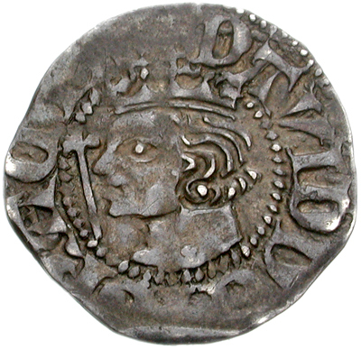

# David II of Scotland

- **Name**: David II
- **Succession**: King of Scots
- **Image**: Scotland penny 802002 (obverse).jpg
- **Caption**: A coin depicting David II
- **Reign**: 7 June 1329 –; 22 February 1371
- **Coronation**: 24 November 1331
- **Predecessor**: Robert I
- **Successor**: Robert II
- **Reg Type**: Regents
- **Regent**: Thomas Randolph, 1st Earl of Moray (1329–1332); Donald, Earl of Mar (1332); Sir Andrew Murray (1332); Sir Archibald Douglas (1332–1333); Robert Stewart, 7th High Steward (1334–1335); John Randolph, 3rd Earl of Moray (1334–1335); Sir Andrew Murray (1335–1338); Robert Stewart, 7th High Steward; (1338–1341, 1346–1357)
- **Regent1**: Edward Balliol (1332–1356)
- **Reg Type1**: Contender
- **Spouses**: Joan of England (1328–1362); Margaret Drummond (1364–1370)
- **House**: Bruce
- **Father**: Robert I of Scotland
- **Mother**: Elizabeth de Burgh
- **Birth Date**: 5 March 1324
- **Birth Place**: Dunfermline Abbey, Fife, Scotland
- **Death Date**: 22 February 1371 (aged 46)
- **Death Place**: Edinburgh Castle, Edinburgh, Scotland
- **Burial Place**: Holyrood Abbey
