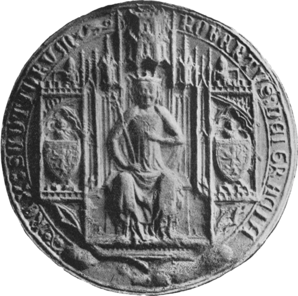

# Robert II of Scotland

- **Name**: Robert II
- **Succession**: King of Scots
- **Image**: Robert II, King of Scotland seal.png
- **Caption**: Great Seal of Robert II
- **Reign**: 22 February 1371 –; 19 April 1390
- **Coronation**: 26 March 1371
- **Predecessor**: David II
- **Successor**: Robert III
- **Reg Type**: Regents
- **Spouses**: Elizabeth Mure (1336–1355); Euphemia de Ross (1355–1386)
- **Issue**: Robert III; Walter, Lord of Fife; Robert, Duke of Albany; Alexander, Earl of Buchan; David, Earl of Caithness; Walter, Earl of Atholl; Elizabeth, Countess of Crawford; Thomas, Bishop of St. Andrews Egidia Stewart
- **Issue Link**: #Marriages and issue
- **Issue Pipe**: more...
- **House**: Stewart
- **Father**: Walter Stewart, 6th High Steward of Scotland
- **Mother**: Marjorie Bruce
- **Birth Date**: 2 March 1316
- **Birth Place**: Paisley Abbey, Renfrewshire, Scotland
- **Death Date**: 19 April 1390 (aged 74)
- **Death Place**: Dundonald Castle, Ayrshire, Scotland
- **Burial Place**: Scone Abbey
