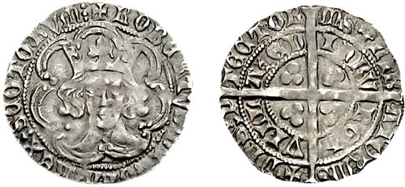

# Robert III of Scotland

- **Name**: Robert III
- **Succession**: King of Scots
- **Image**: File:Robert III Scotland groat 1390 701268.jpg
- **Caption**: Groat of 1390 bearing a crowned facing effigy of Robert III on the obverse
- **Reign**: 19 April 1390 – 4 April 1406
- **Coronation**: 14 August 1390
- **Predecessor**: Robert II
- **Successor**: James I
- **Reg Type**: Regents
- **Spouse**: Annabella Drummond (1367–1401)
- **Issue**: Margaret Stewart, Duchess of Touraine; Elizabeth Stewart; David Stewart, Duke of Rothesay; Mary Stewart; James I, King of Scots
- **Issue Link**: #Family and issue
- **Issue Pipe**: more...
- **House**: Stewart
- **Father**: Robert II of Scotland
- **Mother**: Elizabeth Mure
- **Birth Name**: John Stewart
- **Birth Date**: c. 5 March 1337
- **Death Date**: 4 April 1406
- **Death Place**: Rothesay Castle, Isle of Bute, Scotland
- **Burial Place**: Paisley Abbey
- **Framestyle**: border:none; padding: 0
- **Title**: Events
