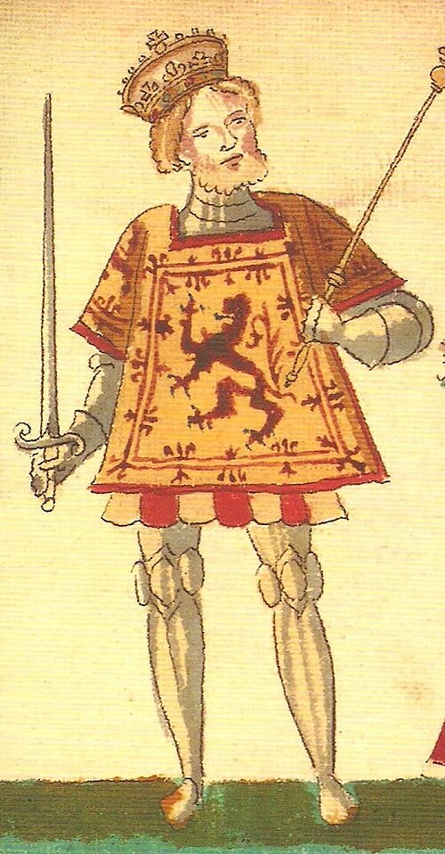

# James I of Scotland

- **Name**: James I
- **Succession**: King of Scots
- **More**: sc
- **Image**: File:James I in the Froman Armorial.jpg
- **Alt**: King James I
- **Caption**: Portrait in the Forman Armorial, 1562
- **Reign**: 4 April 1406 – 21 February 1437
- **Coronation**: 21 May 1424
- **Predecessor**: Robert III
- **Successor**: James II
- **Spouse**: Joan Beaufort (1424–present)
- **Issue**: Margaret, Dauphine of France; Isabella, Duchess of Brittany; Eleanor, Archduchess of Austria; Mary, Countess of Buchan; Joan, Countess of Morton; Alexander, Duke of Rothesay; James II, King of Scots; Annabella, Countess of Huntly
- **House**: Stewart
- **Father**: Robert III of Scotland
- **Mother**: Annabella Drummond
- **Birth Date**: possibly 25 July 1394
- **Birth Place**: Dunfermline Abbey, Fife
- **Death Date**: 21 February 1437 (aged around 42)
- **Death Place**: Blackfriars, Perth
- **Burial Place**: Perth Charterhouse
- **Religion**: Roman Catholic
- **Framestyle**: border:none; padding:0
- **Title**: Events
