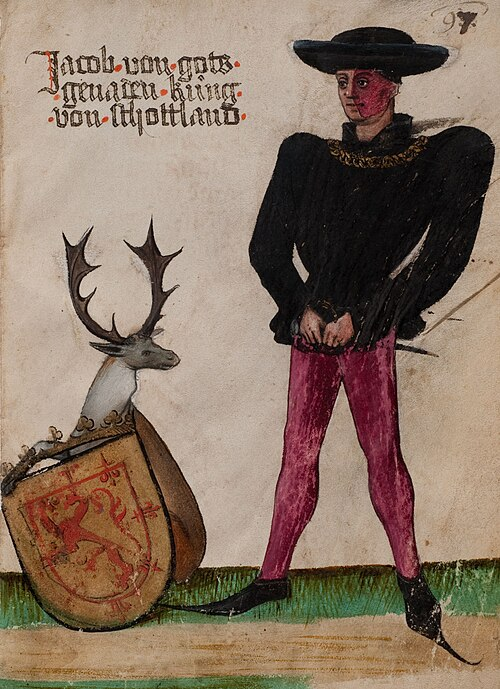

# James II of Scotland

- **Name**: James II
- **Succession**: King of Scots
- **More**: sc
- **Image**: James_II_of_Scotland_(by_von_Ehingen).jpg
- **Caption**: Contemporary image of the king, showing his distinctive facial birthmark
- **Reign**: 21 February 1437 –; 3 August 1460
- **Coronation**: 26 March 1437
- **Predecessor**: James I
- **Successor**: James III
- **Spouse**: Mary of Guelders (1449–present)
- **Issue**: Mary; James III of Scotland; Alexander, Duke of Albany; David, Earl of Moray; John, Earl of Mar; Margaret
- **House**: Stewart
- **Father**: James I of Scotland
- **Mother**: Joan Beaufort
- **Birth Date**: 16 October 1430
- **Birth Place**: Holyrood Palace, Scotland
- **Death Date**: 1460-08-03
- **Death Place**: Roxburgh Castle, Roxburghshire, Scotland
- **Burial Place**: Holyrood Abbey
