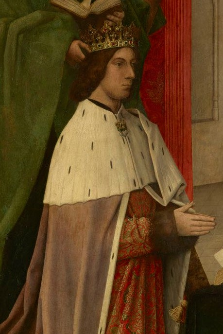

# James III of Scotland

- **Name**: James III
- **Succession**: King of Scots
- **More**: sc
- **Image**: Hugo van der Goes - The Trinity Altarpiece - James III of Scotland accompanied by his son James, presented by St Andrew (cropped).jpg
- **Caption**: James III depicted in the Trinity Altarpiece by Hugo van der Goes, 1480
- **Reign**: 3 August 1460 – 11 June 1488
- **Coronation**: 10 August 1460
- **Predecessor**: James II
- **Successor**: James IV
- **Reg Type**: Regents
- **Regent**: Mary of Guelders (1460–1463); James Kennedy,; Bishop of St Andrews; (1463–1465); Gilbert Kennedy, 1st Lord Kennedy (1465–1466); Robert Boyd, 1st Lord Boyd (1466–1469)
- **Spouse**: Margaret of Denmark (July 1469–14 July 1486, died)
- **Issue**: James IV; James, Duke of Ross; John, Earl of Mar
- **House**: Stewart
- **Father**: James II of Scotland
- **Mother**: Mary of Guelders
- **Birth Date**: 1451 or 1452
- **Birth Place**: Stirling Castle; or St Andrews Castle, Scotland
- **Death Date**: 1488-06-11 (aged 35-37)
- **Death Place**: Sauchieburn, Stirlingshire, Scotland
- **Burial Place**: Cambuskenneth Abbey
