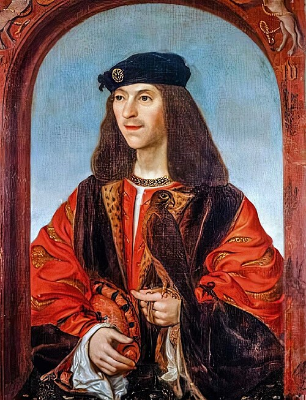

# James IV

- **Name**: James IV
- **Succession**: King of Scotland
- **Image**: James IV of Scotland (2).jpg
- **Caption**: James IV, copy by Daniël Mijtens of a lost contemporary portrait.
- **Reign**: 11 June 1488 –; 9 September 1513
- **Coronation**: 24 June 1488
- **Predecessor**: James III
- **Successor**: James V
- **Spouse**: Margaret Tudor (1503–present)
- **Issue**: James V; Alexander Stewart, Duke of Ross; Illegitimate:; Alexander Stewart, Archbishop of St Andrews; Margaret Stewart, Lady Gordon; James Stewart, 1st Earl of Moray; Janet Stewart, Lady Fleming
- **Issue Link**: #Issue
- **Issue Pipe**: more...
- **House**: Stewart
- **Father**: James III of Scotland
- **Mother**: Margaret of Denmark
- **Birth Date**: 17 March 1473
- **Birth Place**: Stirling Castle, Stirling, Scotland
- **Death Date**: 9 September 1513 (aged 40)
- **Death Place**: Branxton, Northumberland, England
- **Signature**: Signature of James IV of Scotland.svg
