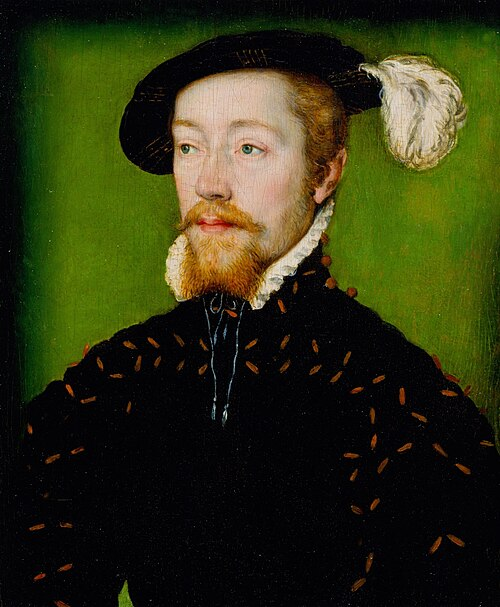

# James V

- **Name**: James V
- **Image**: Portrait of James V of Scotland (1512_-_1542).jpg
- **Caption**: Portrait by Corneille de Lyon,
- **Succession**: King of Scotland
- **Reign**: 9 September 1513 –; 14 December 1542
- **Coronation**: 21 September 1513
- **Predecessor**: James IV
- **Successor**: Mary
- **Regent**: * Margaret Tudor (1513–1514, 1524–1525) * John Stewart, Duke of Albany (1514–1524)
- **Reg Type**: Regents
- **Birth Date**: 10 April 1512
- **Birth Place**: Linlithgow Palace, Linlithgow, Scotland
- **Death Date**: 1542-12-14
- **Death Place**: Falkland Palace, Fife, Scotland
- **Spouses**: Madeleine of France (1 January 1537–7 July 1537); Mary of Guise (1538–present)
- **Issue**: * James, Duke of Rothesay *Robert, Duke of Albany * Mary, Queen of Scots * Illegitimate: * James Stewart, Commendator of Kelso and Melrose * James Stewart, 1st Earl of Moray * John Stewart, Commendator of Coldingham * Robert Stewart, 1st Earl of Orkney * Jean Campbell, Countess of Argyll
- **Issue Link**: #Issue
- **Issue Pipe**: more...
- **House**: Stewart
- **Father**: James IV of Scotland
- **Mother**: Margaret Tudor
- **Burial Date**: 8 January 1543
- **Burial Place**: Holyrood Abbey
- **Religion**: Catholicism
- **Signature**: Signature of James V of Scotland.svg
