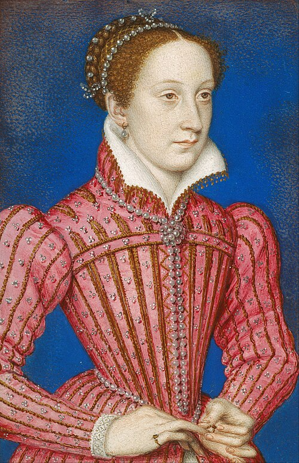

# Mary, Queen of Scots

- **Name**: Mary Stuart
- **Image**: François Clouet - Mary%2C Queen of Scots %281542-87%29 - Google Art Project.jpg
- **Caption**: Portrait of Mary at about 17 years old,
- **Succession**: Queen of Scotland
- **Reign**: 14 December 1542 – 24 July 1567
- **Coronation**: 9 September 1543
- **Cor Type**: Coronation
- **Predecessor**: James V
- **Successor**: James VI
- **Regent**: James Hamilton, 2nd Earl of Arran (1542–54); Mary of Guise (1554–60)
- **Reg Type**: Regents
- **Succession1**: Queen consort of France
- **Reign1**: 10 July 1559 – 5 December 1560
- **Reign Type1**: Tenure
- **Birth Date**: 8 December 1542
- **Birth Place**: Linlithgow Palace, Linlithgow, Scotland
- **Death Date**: 8 February 1587 (aged 44)
- **Death Place**: Fotheringhay Castle, Northamptonshire, England
- **Death Cause**: Execution
- **Burial Date**: 30 July 1587
- **Burial Place**: Peterborough Cathedral 28 October 1612; Westminster Abbey
- **Spouses**: Francis II of France (24 April 1558–5 December 1560); Henry Stuart, Lord Darnley (29 July 1565–10 February 1567); James Hepburn, 4th Earl of Bothwell (15 May 1567–14 April 1578)
- **Issue**: James VI and I
- **House**: Stuart
- **Father**: James V
- **Mother**: Mary of Guise
- **Religion**: Roman Catholicism
- **Signature**: MaryIofScotlandSig.svg
