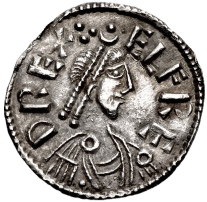

# Alfred the Great

- **Succession**: King of the West Saxons
- **Reign**: 23 April 871 – c. 886
- **Predecessor**: Æthelred I
- **Succession1**: King of the Anglo-Saxons
- **Reign1**: c. 886 – 26 October 899
- **Successor1**: Edward the Elder
- **Image**: Alfred the Great, silver penny; struck 875–880 (obverse).png
- **Caption**: Silver penny of Alfred, struck c. 875–880.; Legend: elfre d rex
- **House**: Wessex
- **Issue**: Æthelflæd, Lady of the Mercians; Edward the Elder; Æthelgifu, Abbess of Shaftesbury; Ælfthryth, Countess of Flanders; Æthelweard
- **Birth Date**: 847–849
- **Birth Place**: Wantage, Berkshire, Wessex
- **Death Date**: 26 October 899 (aged c. 50–52)
- **Death Place**: Winchester, Hampshire, Wessex
- **Burial Date**: c. 1100
- **Burial Place**: Hyde Abbey (now lost), Winchester, Hampshire, England
- **Spouse**: Ealhswith (868–present)
- **Father**: Æthelwulf, King of Wessex
- **Mother**: Osburh
