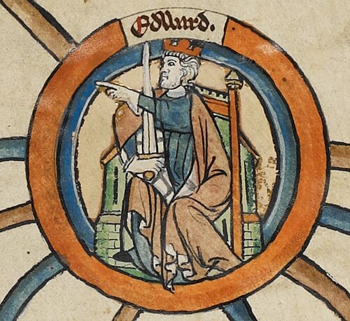

# Edward the Elder

- **Image**: Edward the Elder - MS Royal 14 B VI.jpg
- **Caption**: Portrait miniature from a thirteenth-century genealogical scroll depicting Edward
- **Succession**: King of the Anglo-Saxons
- **Reign**: 26 October 899–17 July 924
- **Coronation**: 8 June 900; Kingston upon Thames
- **Predecessor**: Alfred the Great
- **Successor**: Æthelstan (or Ælfweard, disputed)
- **House**: Wessex
- **Spouses**: Ecgwynn; Ælfflæd; Eadgifu
- **Issue**: Æthelstan, King of the English; A daughter who was Queen of York (possibly Edith of Polesworth); Ælfweard; Edwin; Eadgifu, Queen of the West Franks; Eadhild, Duchess of the Franks; Eadgyth, Queen of the East Franks; Edmund I, King of the English; Eadred, King of the English; Eadburh
- **Issue Link**: #Marriages and children
- **Issue Pipe**: more ...
- **Father**: Alfred the Great
- **Mother**: Ealhswith
- **Birth Date**: Probably mid-870s
- **Death Date**: 0924-07-17
- **Death Place**: Farndon, Cheshire, Mercia
- **Burial Place**: New Minster, Winchester, later translated to Hyde Abbey
