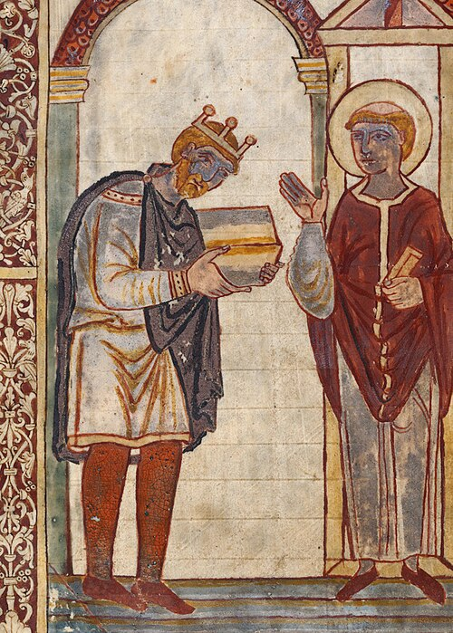

# Æthelstan

- **Name**: Æthelstan
- **Image**: Athelstan (cropped).jpg
- **Caption**: Æthelstan presenting a book to St Cuthbert, an illustration in a manuscript of Bede's Life of Saint Cuthbert, probably presented to the saint's shrine in Chester-le-Street in County Durham by Æthelstan when he visited the shrine on his journey to Scotland in 934. He wore a crown of a similar design on his crowned bust coins. It is the oldest surviving portrait of an English king, and the manuscript is the oldest surviving made for an English king.
- **Alt**: refer to caption
- **Succession**: King of the Anglo-Saxons
- **Reign**: 924–927
- **Coronation**: 4 September 925; Kingston upon Thames
- **Predecessor**: Edward the Elder
- **Successor**: Himself (as King of the English)
- **Succession1**: King of the English
- **Reign1**: 927 – 27 October 939
- **Predecessor1**: Himself (as King of the Anglo-Saxons)
- **Successor1**: Edmund I
- **Birth Date**: c. 894
- **Birth Place**: Winchester, Wessex
- **Death Date**: 27 October 939 (aged about 45)
- **Death Place**: Gloucester, Kingdom of England
- **Burial Place**: Malmesbury Abbey
- **House**: Wessex
- **Father**: Edward the Elder
- **Mother**: Ecgwynn
