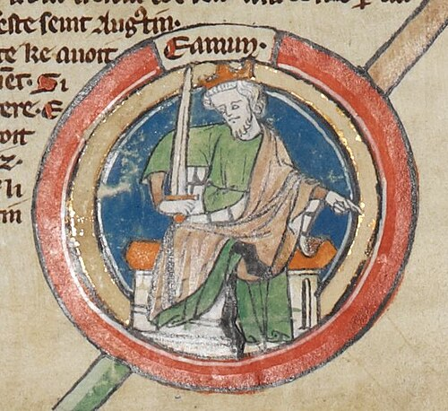

# Edmund I

- **Name**: Edmund I
- **Succession**: King of the English
- **Image**: Edmund I - MS Royal 14 B VI.jpg
- **Caption**: Edmund in the late thirteenth-century Genealogical Chronicle of the English Kings
- **Alt**: An illustrated manuscript drawing of Edmund wearing a green robe and a gold crown holding a sword
- **Reign**: 27 October 939– 26 May 946
- **Coronation**: c. 1 December 939
- **Predecessor**: Æthelstan
- **Successor**: Eadred
- **House**: Wessex
- **Birth Date**: 920/921
- **Death Date**: 26 May 946 (aged 24–26)
- **Death Place**: Pucklechurch, Gloucestershire, England
- **Burial Place**: Glastonbury Abbey
- **Spouses**: Ælfgifu; Æthelflæd
- **Issue**: Eadwig, King of the English; Edgar, King of the English
- **Father**: Edward the Elder
- **Mother**: Eadgifu
