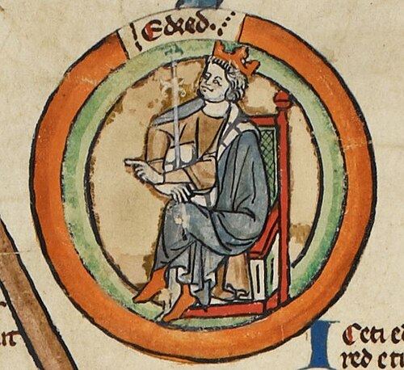

# Eadred

- **Succession**: King of the English
- **Image**: Eadred - MS Royal 14 B VI.jpg
- **Caption**: Eadred in the early fourteenth-century Genealogical Roll of the Kings of England
- **Reign**: 26 May 946 – 23 November 955
- **Coronation**: 16 August 946; Kingston upon Thames
- **Predecessor**: Edmund I
- **Successor**: Eadwig
- **House**: Wessex
- **Birth Date**: c. 923
- **Birth Place**: Wessex
- **Death Date**: 23 November 955 (aged c. 32)
- **Death Place**: Frome, Somerset
- **Burial Place**: Old Minster, Winchester. Bones now in Winchester Cathedral
- **Father**: Edward the Elder
- **Mother**: Eadgifu
