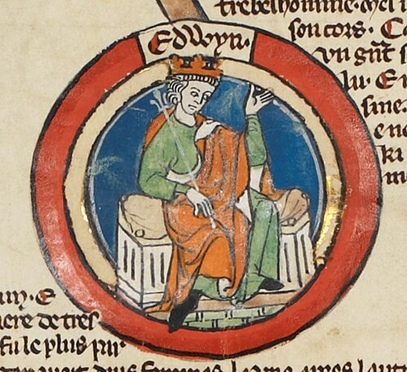

# Eadwig

- **Succession**: King of the English
- **Image**: Eadwig - MS Royal 14 B VI.jpg
- **Caption**: Eadwig in the early fourteenth-century Genealogical Roll of the Kings of England
- **Alt**: Early fourteenth-century portrait of Eadwig
- **Reign**: 23 November 955 – 1 October 959
- **Predecessor**: Eadred
- **Successor**: Edgar
- **House**: Wessex
- **Birth Date**: 940/941
- **Death Date**: 1 October 959 (aged c. 19)
- **Burial Place**: New Minster, Winchester
- **Spouse**: Ælfgifu (annulled)
- **Father**: Edmund I
- **Mother**: Ælfgifu
