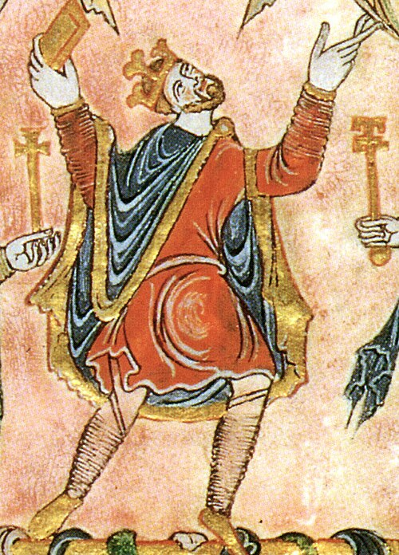

# Edgar, King of England

- **Image**: New Minster Charter 966 detail Edgar.jpg
- **Name**: Edgar
- **Caption**: Edgar's contemporary likeness from the New Minster Charter.
- **Succession**: King of the English
- **Reign**: 1 October 959 – 8 July 975
- **Coronation**: 11 May 973
- **Predecessor**: Eadwig
- **Successor**: Edward the Martyr
- **House**: Wessex
- **Spouses**: Æthelflæd; Wulfthryth; Ælfthryth
- **Issue**: Edward the Martyr; Edith of Wilton; Edmund; Æthelred the Unready
- **Father**: Edmund I
- **Mother**: Ælfgifu of Shaftesbury
- **Birth Date**: 943/944
- **Birth Place**: England
- **Death Date**: 8 July 975 (aged 31/32)
- **Burial Place**: Glastonbury Abbey
