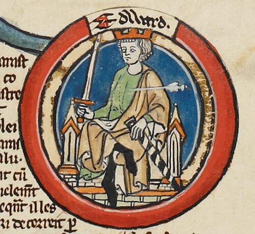

# Edward the Martyr

- **Image**: Edward the Martyr - MS Royal 14 B VI.jpg
- **Caption**: Edward in an early fourteenth-century Genealogical Roll of the Kings of England
- **Alt**: Portrait of Edward the Martyr
- **Succession**: King of the English
- **Reign**: 8 July 975 – 18 March 978
- **Predecessor**: Edgar
- **Successor**: Æthelred II
- **Birth Date**: c. 962
- **Death Date**: 18 March 978 (aged about 16)
- **Death Place**: Corfe, Dorset
- **House**: Wessex
- **Father**: Edgar
- **Mother**: Æthelflæd (probably)
- **Burial Place**: Wareham, Dorset; later Shaftesbury, Dorset
