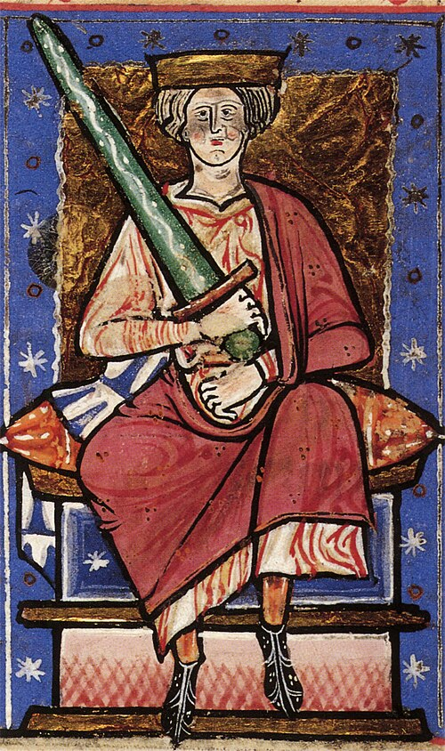

# Æthelred the Unready

- **Image**: Ethelred the Unready.jpg
- **Caption**: Æthelred in the Abingdon Chronicle, c. 1220
- **Succession**: King of the English
- **Reign1**: 18 March 978 – December 1013
- **Reign Type1**: Reign 1
- **Predecessor1**: Edward the Martyr
- **Successor1**: Swein Forkbeard
- **Reign2**: February 1014 – 23 April 1016
- **Reign Type2**: Reign 2
- **Predecessor2**: Swein Forkbeard
- **Successor2**: Edmund II
- **House**: Wessex
- **Spouses**: Ælfgifu of York?; Emma of Normandy
- **Issue**: Æthelstan; Ecgberht; Edmund; Eadred; Eadwig; Edgar; Eadgyth; Ælfgifu; Edward; Alfred; Godgifu
- **Issue Link**: #Marriages and issue
- **Issue Pipe**: Detail
- **Father**: Edgar
- **Mother**: Ælfthryth
- **Birth Date**: c. 968
- **Birth Place**: England
- **Death Date**: 23 April 1016 (aged about 48)
- **Death Place**: London, England
- **Burial Place**: Old St Paul's Cathedral, destroyed in the Great Fire of London
