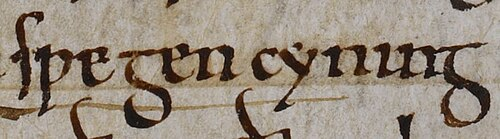

# Swein Forkbeard

- **Image**: Sveinn Haraldsson (British Library Cotton MS Tiberius B I, folio 151r).jpg
- **Image Size**: 220
- **Alt**: Image of Swein's name
- **Caption**: Swegen cyning (King Swein) in folio 151r of manuscript C of the Anglo-Saxon Chronicle
- **Succession**: King of Denmark
- **Reign**: c. 986 – 3 February 1014
- **Predecessor**: Harald Bluetooth
- **Successor**: Harald II
- **Succession2**: King of England
- **Reign2**: December 1013 – 3 February 1014
- **Predecessor2**: Æthelred the Unready
- **Successor2**: Æthelred the Unready
- **Spouse**: Sister of Boleslaus, ruler of Poland (name not known)
- **Issue**: Harald; Cnut; Estrid; Gytha
- **Father**: Harald Bluetooth
- **Mother**: Not known
- **Death Date**: 3 February 1014
- **Death Place**: Gainsborough, Lincolnshire, England
- **Burial Place**: Roskilde
