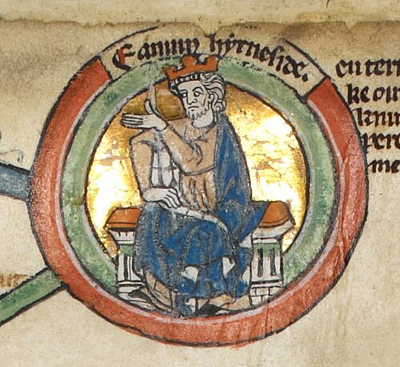

# Edmund Ironside

- **Image**: Edmund Ironside - MS Royal 14 B VI.jpg
- **Alt**: Edmund depicted in a circular icon
- **Caption**: Edmund in the early 14th century Genealogical Roll of the Kings of England
- **Succession**: King of the English
- **Reign**: 23 April–30 November 1016
- **Predecessor**: Æthelred II
- **Successor**: Cnut
- **House**: Wessex
- **Spouse**: Ealdgyth
- **Issue**: Edward the Exile; Edmund Ætheling
- **Father**: Æthelred II
- **Mother**: Ælfgifu of York
- **Birth Date**: c. 991
- **Birth Place**: England
- **Death Date**: 30 November 1016 (aged 24–25)
- **Death Place**: Oxford or London, England
- **Burial Place**: Glastonbury Abbey
