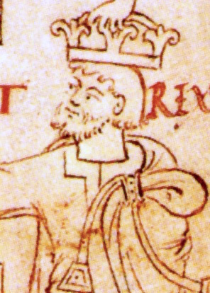

# Cnut

- **Image**: Canute and Ælfgifu cropped (Canute).jpg
- **Caption**: Contemporary drawing of King Cnut; from the New Minster Liber Vitae, 1031
- **Succession**: King of England
- **Reign**: 1016–1035
- **Coronation**: 1017 in London
- **Successor**: Harold I
- **Predecessor**: Edmund II
- **Succession1**: King of Denmark
- **Reign1**: 1018–1035
- **Successor1**: Harthacnut
- **Predecessor1**: Harald II
- **Succession2**: King of Norway
- **Reign2**: 1028–1035
- **Successor2**: Magnus the Good
- **Predecessor2**: Saint Olaf
- **Regent2**: Svein Knutsson
- **Reg Type2**: Co-king
- **House**: Knýtlinga
- **Birth Date**: c. 995
- **Birth Place**: Kingdom of Denmark
- **Death Date**: 12 November 1035 (aged around 40)
- **Death Place**: Shaftesbury, Dorset, England
- **Burial Place**: Old Minster, Winchester, England; Bones now in Winchester Cathedral, Winchester, England
- **Spouses**: Ælfgifu of Northampton; Emma of Normandy
- **Issue**: Svein Knutsson; Harold Harefoot; Harthacnut; Gunhilda, Queen of the Germans
- **Father**: Swein Forkbeard
- **Mother**: Sigrid Storråda or Gunhild of Wenden
