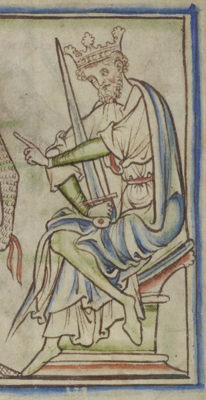

# Harold Harefoot

- **Name**: Harold I
- **Image**: Harold Harefoot in the Cambridge University Library.jpg
- **Caption**: Harold Harefoot drawn in the 13th century, from The Life of King Edward the Confessor by Matthew Paris
- **Succession**: King of England
- **Reign**: after 12 November 1035–17 March 1040
- **Predecessor**: Cnut
- **Successor**: Harthacnut
- **House**: Knýtlinga
- **Death Date**: 17 March 1040
- **Death Place**: Oxford, England
- **Burial Place**: Westminster Abbey, then moved to St. Clement Danes, Westminster, England
- **Spouse**: Ælfgifu?
- **Issue**: Ælfwine?
- **Father**: Cnut, King of England
- **Mother**: Ælfgifu of Northampton
