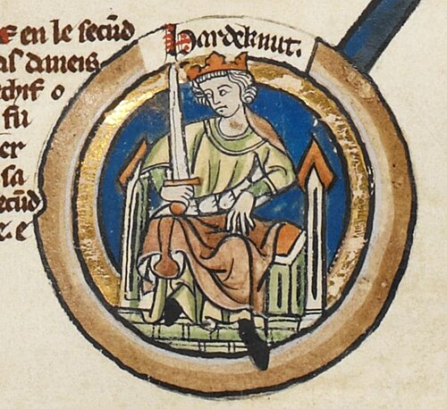

# Harthacnut

- **Image**: Harthacnut - MS Royal 14 B VI.jpg
- **Caption**: Harthacnut in the 14th-century Genealogical Roll of the Kings of England
- **Succession**: King of Denmark
- **Reign**: 12 November 1035 – 8 June 1042
- **Predecessor**: Cnut the Great
- **Successor**: Magnus I
- **Succession1**: King of England
- **Reign1**: 1040 – 8 June 1042
- **Predecessor1**: Harold I
- **Successor1**: Edward the Confessor
- **House**: Knýtlinga
- **Father**: Cnut the Great
- **Mother**: Emma of Normandy
- **Birth Date**: c. 1018
- **Birth Place**: England
- **Death Date**: 8 June 1042
- **Death Place**: Lambeth, England
- **Burial Place**: Aarhus Cathedral, Denmark
