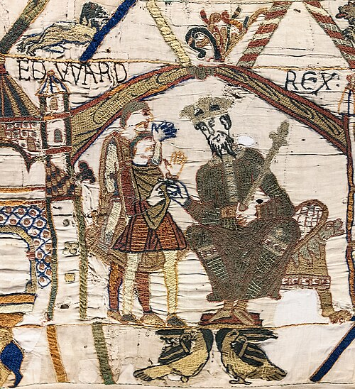

# Edward the Confessor

- **Image**: Bayeux_Tapestry_scene1_EDWARD_REX.jpg
- **Caption**: la: Edward the Confessor, enthroned, opening scene of the Bayeux Tapestry
- **Succession**: King of the English
- **Reign**: 8 June 1042 – 5 January 1066
- **Coronation**: 3 April 1043 ; Winchester Cathedral
- **Predecessor**: Harthacnut
- **Successor**: Harold II
- **Spouse**: Edith of Wessex (1045–present)
- **House**: Wessex
- **Father**: Æthelred the Unready
- **Mother**: Emma of Normandy
- **Birth Date**: 1003/1005
- **Birth Place**: Islip, Oxfordshire, England
- **Death Date**: 5 January 1066 (aged 60–63)
- **Death Place**: Westminster, London, England
- **Burial Place**: Westminster Abbey
