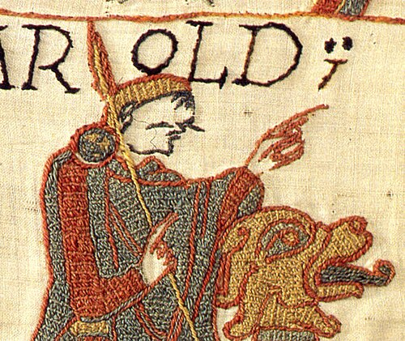

# Harold Godwinson

- **Succession**: King of the English
- **Name**: Harold II
- **Image**: File:Bayeux tapestry stitches detail..jpg
- **Caption**: Harold Godwinson, from the Bayeux Tapestry
- **Reign**: 5 January – 14 October 1066
- **Coronation**: 6 January 1066
- **Predecessor**: Edward the Confessor
- **Successor**: William I
- **Spouses**: Edith the Fair; Ealdgyth of Mercia
- **Issue**: Godwin; Edmund; Magnus; Gunhild; Gytha; Harold; Ulf
- **House**: Godwin
- **Father**: Godwin, Earl of Wessex
- **Mother**: Gytha Thorkelsdóttir
- **Birth Date**: c. 1022/23
- **Birth Place**: Wessex, England
- **Death Date**: 14 October 1066
- **Death Place**: near Senlac Hill, Sussex, England
- **Burial Place**: Waltham Abbey, Essex, or Bosham, Sussex (disputed)
