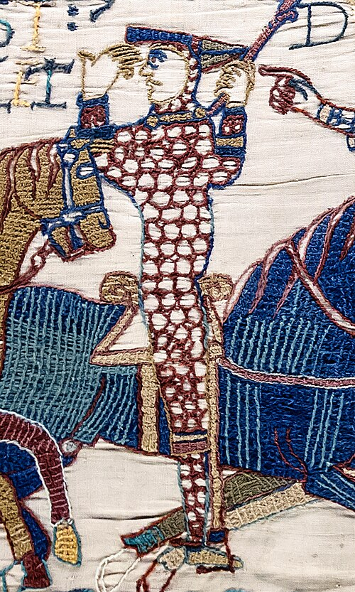

# William the Conqueror

- **Image**: William the Conqueror (TFA).jpg
- **Caption**: William is depicted in the Bayeux Tapestry during the Battle of Hastings, lifting his helmet to show that he is still alive.
- **Succession**: King of England
- **Reign**: 1066 – 1087
- **Coronation**: 25 December 1066
- **Cor Type**: Coronation
- **Predecessor**: Edgar Ætheling (uncrowned); Harold II (crowned)
- **Successor**: William II
- **Succession1**: Duke of Normandy
- **Reign1**: 1035 – 1087
- **Predecessor1**: Robert I
- **Successor1**: Robert II
- **Spouse**: Matilda of Flanders (1051/2; 1083)
- **Issue**: Robert II, Duke of Normandy; Richard; Adeliza; Cecilia; William II, King of England; Constance, Duchess of Brittany; Adela, Countess of Blois; Henry I, King of England
- **Issue Link**: #Family and children
- **House**: Normandy
- **Father**: Robert the Magnificent
- **Mother**: Herleva of Falaise
- **Birth Place**: Falaise, Duchy of Normandy
- **Death Date**: 9 September 1087 (aged about 59)
- **Death Place**: Priory of Saint Gervase, Rouen, Duchy of Normandy
- **Burial Place**: Saint-Étienne de Caen, Normandy
