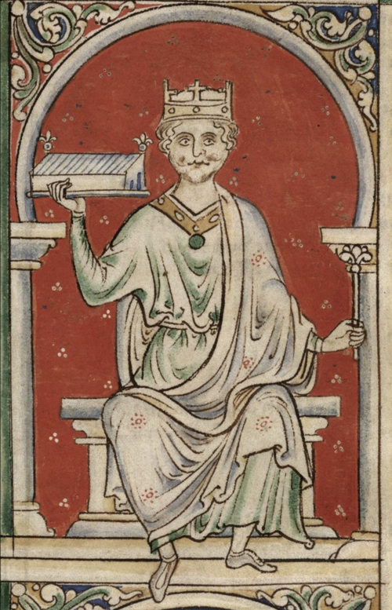

# William II of England

- **Name**: William II
- **Image**: William II of England Historia Anglorum.png
- **Caption**: Miniature from Matthew Paris's Historia Anglorum,
- **Succession**: King of England
- **More Text**: (more...)
- **Reign**: 1087 – 1100
- **Coronation**: 26 September 1087
- **Cor Type**: britain
- **Predecessor**: William I
- **Successor**: Henry I
- **House**: Normandy
- **Father**: William the Conqueror
- **Mother**: Matilda of Flanders
- **Birth Place**: Duchy of Normandy
- **Death Date**: 2 August 1100 (aged approximately 43–44)
- **Death Place**: New Forest, Hampshire, England
- **Burial Place**: Winchester Cathedral
