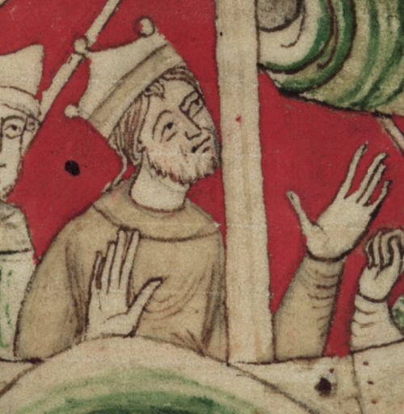

# Henry I of England

- **Name**: Henry I
- **Image**: Worcester chronicle - Henry I in a hulk.png
- **Caption**: Miniature from John of Worcester's Chronicon ex Chronicis, .
- **Succession**: King of England
- **More Text**: (more ...)
- **Reign**: 1100 –1135
- **Coronation**: 5 August 1100
- **Cor Type**: britain
- **Predecessor**: William II
- **Successor**: Stephen
- **Succession1**: Duke of Normandy
- **Reign1**: 1106 – 1 December 1135
- **Predecessor1**: Robert Curthose
- **Successor1**: Stephen
- **Spouses**: * Matilda of Scotland (1100–1118) * Adeliza of Louvain (1121–present)
- **Issue**: * Matilda, Holy Roman Empress * William Adelin, Duke of Normandy Illegitimate * Robert, 1st Earl of Gloucester * Aline, Lady of Montmorency * Juliane de Fontevrault * Matilda, Countess of Perche * Richard of Lincoln * Sybilla, Queen of Scots * Reginald, 1st Earl of Cornwall * Matilda, Duchess of Brittany * Robert, Lord of Okehampton * Matilda, Abbess of Montvilliers * Henry FitzRoy * Fulk FitzRoy * Gilbert FitzRoy
- **Issue Link**: #Family and children
- **Issue Pipe**: more ...
- **House**: Normandy
- **Father**: William the Conqueror
- **Mother**: Matilda of Flanders
- **Birth Place**: possibly Selby, Yorkshire, England
- **Death Date**: 1 December 1135 (aged 66–67)
- **Death Place**: Saint-Denis-en-Lyons, Normandy, France
- **Burial Place**: Reading Abbey
