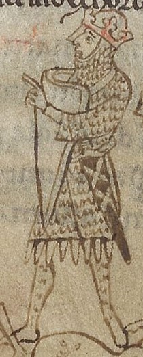

# Stephen, King of England

- **Name**: Stephen
- **Birth Name**: Stephen of Blois
- **Image**: Stepan kral.jpg
- **Caption**: Stephen in a 12th century manuscript depicting the Battle of Lincoln
- **Succession**: King of England
- **More Text**: (more...)
- **Reign**: 22 December 1135 – 25 October 1154
- **Coronation**: 22 December 1135; & 25 December 1141
- **Cor Type**: Coronations
- **Predecessor**: Henry I
- **Successor**: Henry II
- **Regent**: Matilda (1141–1148) and Henry II (1148-1153)
- **Reg Type**: Contender
- **Spouse**: Matilda I, Countess of Boulogne (1125–1152)
- **Issue**: * Eustace IV, Count of Boulogne * Marie I, Countess of Boulogne * William I, Count of Boulogne * Gervase, Abbot of Westminster (ill.)
- **Issue Link**: #Issue
- **Issue Pipe**: more...
- **House**: Blois
- **Father**: Stephen, Count of Blois
- **Mother**: Adela of Normandy
- **Birth Date**: 1092 or 1096
- **Birth Place**: Blois, Kingdom of France
- **Death Date**: 25 October 1154 (aged 57–58 or 61–62)
- **Death Place**: Dover, Kent, Kingdom of England
- **Burial Place**: Faversham Abbey, Kent, England
