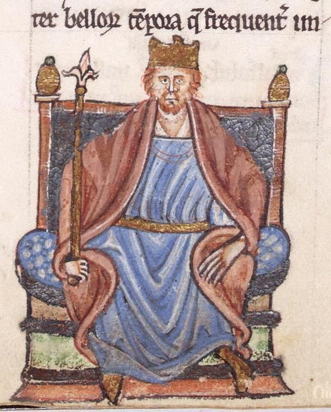

# Henry II of England

- **Name**: Henry II
- **Image**: Henry II Illumination.jpg
- **Alt**: Miniature depiction of Henry II; the red-haired king is crowned and seated on a throne, adorned with a red and blue garment tied with a golden belt at the waist, holding a sceptre.
- **Caption**: Contemporary miniature from the la,
- **Succession**: King of England
- **More Text**: (more...)
- **Reign**: 1154-1189
- **Coronation**: 19 December 1154
- **Predecessor**: Stephen
- **Successor**: Richard I
- **Regent**: Henry the Young King (1170–1183)
- **Reg Type**: Junior king
- **Birth Date**: 5 March 1133
- **Birth Place**: Le Mans, Maine, Kingdom of France
- **Death Date**: 6 July 1189 (aged 56)
- **Death Place**: Chinon Castle, Chinon, Touraine, France
- **Burial Place**: Fontevraud Abbey, Anjou, France
- **Spouse**: Eleanor of Aquitaine (18 May 1152–present)
- **Issue**: William IX, Count of Poitiers; Henry the Young King; Matilda, Duchess of Saxony; Richard I, King of England; Geoffrey II, Duke of Brittany; Eleanor, Queen of Castile; Joan, Queen of Sicily; John, King of England; Illegitimate; Geoffrey, Archbishop of York; William, Earl of Salisbury
- **Issue Link**: #Court and family
- **House**: Plantagenet-Angevin
- **Father**: Geoffrey Plantagenet, Count of Anjou
- **Mother**: Empress Matilda
