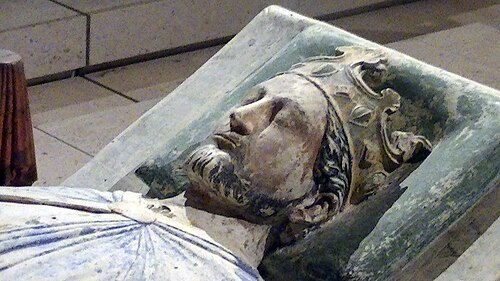

# Richard I

- **Name**: Richard I
- **Image**: Church of Fontevraud Abbey Richard I effigy.jpg
- **Caption**: Effigy ( 1199) at Fontevraud Abbey, Anjou
- **Succession**: King of England
- **Reign**: 1189 – 1199
- **Coronation**: 3 September 1189
- **Predecessor**: Henry II
- **Regent**: Eleanor of Aquitaine; William de Longchamp
- **Successor**: John
- **More Text**: (more..)
- **Issue**: Philip of Cognac (ill.)
- **House**: Plantagenet–Angevin
- **Spouse**: Berengaria of Navarre (1191–present)
- **Father**: Henry II of England
- **Mother**: Eleanor of Aquitaine
- **Birth Date**: 8 September 1157
- **Birth Place**: Beaumont Palace, Oxford, England
- **Death Date**: 6 April 1199 (aged 41)
- **Death Place**: Châlus, Aquitaine
- **Burial Place**: Fontevraud Abbey, Anjou, France
- **Battles**: *Revolt of 1173–1174 *Third Crusade **Siege of Acre **Battle of Arsuf **Battle of Jaffa **Conquest of Cyprus by Richard I *First Hundred Years War **Battle of Fréteval **Battle of Gisors
