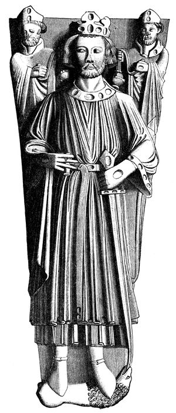

# John, King of England

- **Name**: John
- **Image**: Jan tomb.jpg
- **Alt**: A drawing of the effigy of King John in Worcester Cathedral
- **Caption**: Tomb effigy, Worcester Cathedral
- **Succession**: King of England
- **More Text**: (more ...)
- **Reign**: 1199 –1216
- **Coronation**: 27 May 1199
- **Predecessor**: Richard I
- **Successor**: Henry III
- **Spouses**: Isabella, Countess of Gloucester (1189–1199); Isabella, Countess of Angoulême (1200–present)
- **Issue**: Henry III, King of England; Richard, King of the Romans; Joan, Queen of Scotland; Isabella, Holy Roman Empress; Eleanor, Countess of Pembroke IllegitimateRichard FitzRoy; Joan, Lady of Wales
- **Issue Link**: #Issue
- **House**: Plantagenet-Angevin
- **Father**: Henry II of England
- **Mother**: Eleanor of Aquitaine
- **Birth Date**: Christmastide 1166/7
- **Birth Place**: England
- **Death Date**: 19 October 1216 (aged 49)
- **Death Place**: Newark Castle, Nottinghamshire, England
- **Burial Place**: Worcester Cathedral, England
