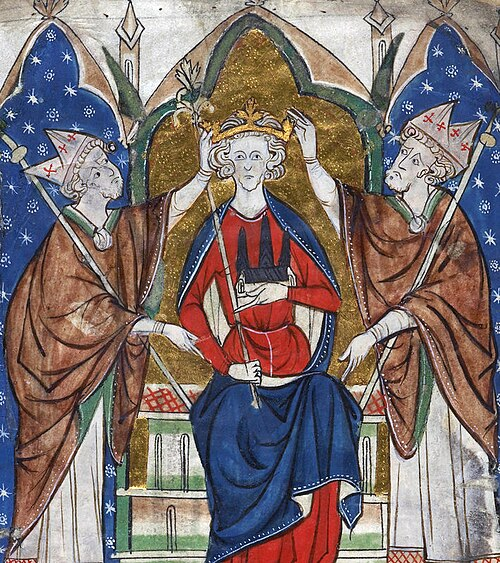

# Henry III of England

- **Type**: monarch
- **Name**: Henry III
- **Image**: HenryIII.jpg
- **Alt**: Henry seated on a throne flanked by bishops
- **Caption**: Henry III depicted in a manuscript,
- **Succession**: King of England
- **More Text**: (more...)
- **Reign**: 1216 – 1272
- **Coronation**: 28 October 1216; Gloucester Abbey; 17 May 1220; Westminster Abbey
- **Cor Type**: britain
- **Predecessor**: John
- **Reg Type**: Regents
- **Regent**: William Marshal, 1st Earl of Pembroke (1216–1219)
- **Successor**: Edward I
- **Spouse**: Eleanor of Provence (January 1236–present)
- **Issue**: Edward I, King of England; Margaret, Queen of Scots; Beatrice, Countess of Richmond; Edmund Crouchback, Earl of Lancaster; Katherine of England
- **Issue Link**: #Issue
- **House**: Plantagenet
- **Father**: John, King of England
- **Mother**: Isabella of Angoulême
- **Birth Date**: 1 October 1207
- **Birth Place**: Winchester Castle, Hampshire, England
- **Death Date**: 16 November 1272 (aged 65)
- **Death Place**: Westminster, London, England
- **Burial Place**: Westminster Abbey, London, England
