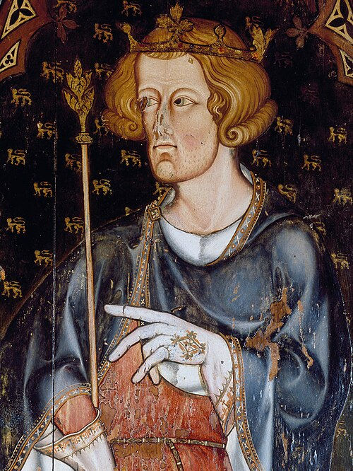

# Edward I

- **Name**: Edward I
- **Image**: Edward I - Westminster Abbey Sedilia.jpg
- **Alt**: Half figure of Edward facing left with short, curly hair and a hint of beard. He wears a coronet and holds a sceptre in his right hand. He has a blue robe over a red tunic, and his hands are covered by white, embroidered gloves. His left hand seems to be pointing left, to something outside the picture.
- **Caption**: Portrait in Westminster Abbey probably depicting Edward I, installed during his reign
- **Succession**: King of England
- **More Text**: (more...)
- **Reign**: 20 November 1272 – 7 July 1307
- **Cor Type**: Coronation
- **Coronation**: 19 August 1274
- **Predecessor**: Henry III
- **Successor**: Edward II
- **Birth Date**: 17/18 June 1239
- **Birth Place**: Palace of Westminster, London, England
- **Death Date**: 7 July 1307 (aged 68)
- **Death Place**: Burgh by Sands, Cumberland, England
- **Burial Date**: 27 October 1307
- **Burial Place**: Westminster Abbey, London
- **Spouses**: Eleanor of Castile (1 November 1254–28 November 1290); Margaret of France (8 September 1299–present)
- **Issue**: Henry of England; Eleanor, Countess of Bar; Joan, Countess of Hertford; Alphonso, Earl of Chester; Margaret, Duchess of Brabant; Berengaria of England; Mary of Woodstock; Elizabeth, Countess of Holland; Edward II, King of England; Thomas, Earl of Norfolk; Edmund, Earl of Kent
- **Issue Link**: #Family
- **Issue Pipe**: more...
- **House**: Plantagenet
- **Father**: Henry III of England
- **Mother**: Eleanor of Provence
