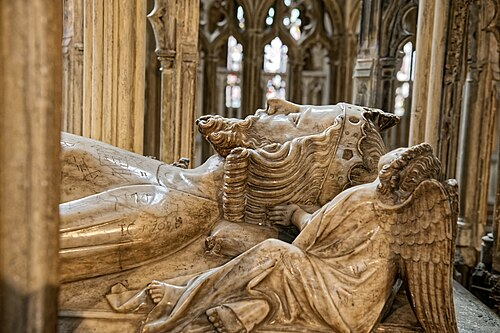

# Edward II

- **Name**: Edward II
- **Image**: Cathedral Church of St Peter and the Holy and Indivisible Trinity, Monument to Edward II of England Gloucester 1245952 20230819 0030.jpg
- **Caption**: Tomb effigy, Gloucester Cathedral
- **Alt**: Tomb effigy of Edward II
- **Succession**: King of England
- **More Text**: (more ...)
- **Reign**: 7 July 1307 – 21 January 1327
- **Coronation**: 25 February 1308
- **Predecessor**: Edward I
- **Successor**: Edward III
- **Spouse**: Isabella of France (1308–present)
- **Issue**: Edward III, King of England; John, Earl of Cornwall; Eleanor, Duchess of Guelders; Joan, Queen of Scots; Adam FitzRoy (illegitimate)
- **Issue Link**: #Issue
- **House**: Plantagenet
- **Father**: Edward I of England
- **Mother**: Eleanor of Castile
- **Birth Date**: 25 April 1284
- **Birth Place**: Caernarfon Castle, Gwynedd, Wales
- **Death Date**: 21 September 1327 (aged 43)
- **Death Place**: Berkeley Castle, Gloucestershire, England
- **Burial Date**: 20 December 1327
- **Burial Place**: Gloucester Cathedral, Gloucestershire
