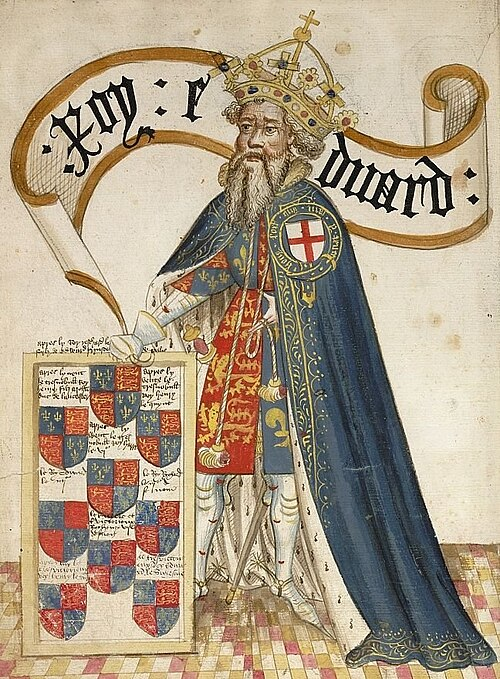

# Edward III

- **Name**: Edward III
- **Image**: Edward III of England (Order of the Garter).jpg
- **Alt**: King Edward III depicted in the Statuta Nova
- **Caption**: Posthumous drawing as head of the Order of the Garter, in the Bruges Garter Book
- **Succession**: King of England
- **More Text**: (more...)
- **Reign**: 25 January 1327 – 21 June 1377
- **Coronation**: 1 February 1327
- **Predecessor**: Edward II
- **Regent**: Isabella of France and Roger Mortimer (1327–1330)
- **Reg Type**: Regents
- **Successor**: Richard II
- **Birth Date**: 13 November 1312
- **Birth Place**: Windsor Castle, Berkshire, England
- **Death Date**: 21 June 1377 (aged 64)
- **Death Place**: Sheen Palace, Richmond, England
- **Burial Date**: 5 July 1377
- **Burial Place**: Westminster Abbey, London
- **Spouse**: Philippa of Hainault (24 January 1328–15 August 1369)
- **Issue**: Edward the Black Prince; Isabella, Countess of Bedford; Joan; Lionel, Duke of Clarence; John of Gaunt; Edmund, Duke of York; Mary, Duchess of Brittany; Margaret, Countess of Pembroke; Thomas, Duke of Gloucester; John de Southeray (ill.)
- **Issue Link**: #Issue
- **Issue Pipe**: more...
- **House**: Plantagenet
- **Father**: Edward II of England
- **Mother**: Isabella of France
