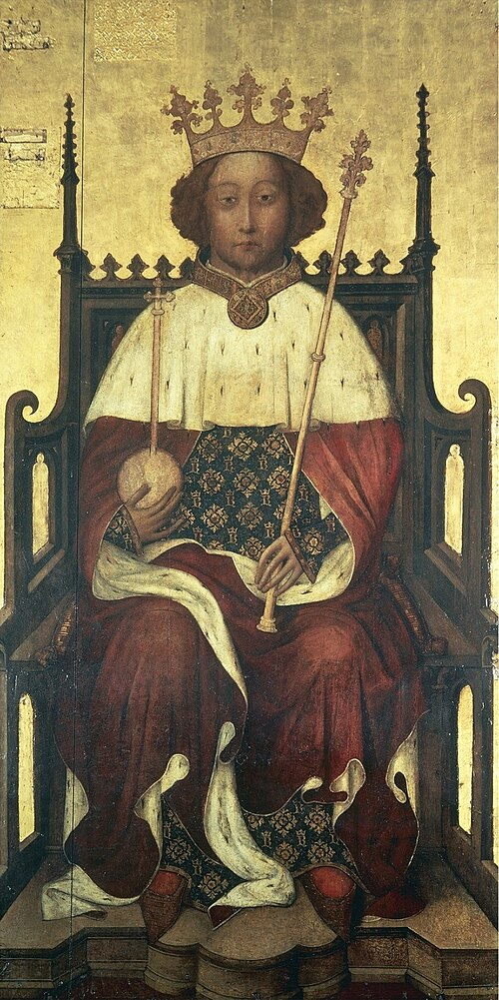

# Richard II

- **Name**: Richard II
- **Image**: The Westminster Portrait of Richard II of England (1390s).jpg
- **Alt**: Portrait of Richard crowned sitting on his throne and holding an orb and sceptre
- **Caption**: Portrait at Westminster Abbey, mid-1390s
- **Succession**: King of England
- **More Text**: (more...)
- **Reign**: 21 June 1377 – 29 September 1399
- **Coronation**: 16 July 1377
- **Predecessor**: Edward III
- **Successor**: Henry IV
- **Birth Date**: 6 January 1367
- **Birth Place**: Bordeaux, France
- **Death Date**: (aged 33)
- **Death Place**: Pontefract Castle, Yorkshire, England
- **Burial Place**: Dominican Friary, Kings Langley, Hertfordshire (1400–1413); Westminster Abbey, London (since 1413)
- **Spouses**: Anne of Bohemia (1382–1394); Isabella of Valois (1396–present)
- **House**: Plantagenet
- **Father**: Edward the Black Prince
- **Mother**: Joan of Kent
- **Signature**: Richard II Signature.svg
