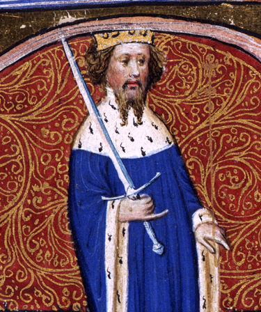

# Henry IV of England

- **Name**: Henry IV
- **Image**: Illumination of Henry IV (cropped).jpg
- **Alt**: Portrait of Henry IV
- **Caption**: Illuminated miniature, 1402
- **Succession**: King of England
- **More Text**: (more...)
- **Reign**: 30 September 1399 –; 20 March 1413
- **Coronation**: 13 October 1399
- **Predecessor**: Richard II
- **Successor**: Henry V
- **Birth Date**: April 1367
- **Birth Place**: Bolingbroke Castle, Lincolnshire, England
- **Death Date**: 20 March 1413 (aged 45)
- **Death Place**: Jerusalem Chamber, Westminster, England
- **Burial Place**: Canterbury Cathedral, Kent, England
- **Spouses**: Mary de Bohun (1381–4 June 1394); Joan of Navarre (7 February 1403–present)
- **Issue**: Henry V, King of England; Thomas, Duke of Clarence; John, Duke of Bedford; Humphrey, Duke of Gloucester; Blanche, Countess Palatine; Philippa, Queen of Denmark, Norway and Sweden
- **Issue Link**: #Marriages and issue
- **Issue Pipe**: more...
- **House**: Lancaster
- **Father**: John of Gaunt
- **Mother**: Blanche of Lancaster
- **Signature**: Henry IV Signature.svg
