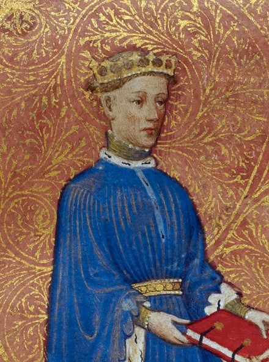

# Henry V of England

- **Name**: Henry V
- **Image**: Henry V Miniature.jpg
- **Caption**: Henry as Prince of Wales in the Regiment of Princes, 1413 (MS Arundel 38)
- **Succession**: King of England
- **More Text**: (more...)
- **Reign**: 21 March 1413 – 31 August 1422
- **Coronation**: 9 April 1413
- **Predecessor**: Henry IV
- **Successor**: Henry VI
- **Succession1**: Regent of France
- **Reign Type1**: Regency
- **Reign1**: 21 May 1420 – 31 August 1422
- **Pre Type1**: Monarch
- **Predecessor1**: Charles VI
- **Birth Date**: 16 September 1386
- **Birth Place**: Monmouth Castle, Wales
- **Death Date**: 31 August 1422 (aged 35)
- **Death Place**: Château de Vincennes, France
- **Burial Date**: 7 November 1422
- **Burial Place**: Westminster Abbey, London
- **Spouse**: Catherine of Valois (2 June 1420–present)
- **Issue**: Henry VI
- **House**: Lancaster
- **Father**: Henry IV of England
- **Mother**: Mary de Bohun
- **Signature**: HenryVSig.svg
