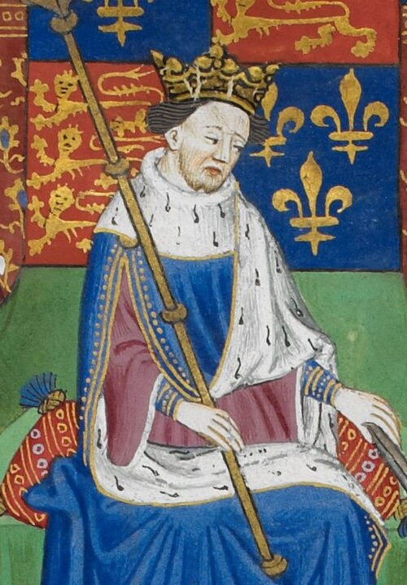

# Henry VI of England

- **Name**: Henry VI
- **Image**: Henry VI of England, Shrewsbury book.jpg
- **Caption**: Miniature in the Talbot Shrewsbury Book, 1444–1445
- **Succession**: King of England
- **More Text**: (more...)
- **Reign Type**: 1st reign
- **Reign**: 1 September 1422 – 4 March 1461
- **Reign Type1**: 2nd reign
- **Reign1**: 3 October 1470 – 11 April 1471
- **Coronation1**: 6 November 1429; Westminster Abbey
- **Predecessor1**: Henry V
- **Successor1**: Edward IV
- **Reg Type1**: Regents
- **Regent1**: Humphrey, Duke of Gloucester (14221429); Cardinal Beaufort (14221437); Richard, Duke of York (14541455, 14551456, 1460)
- **Succession2**: King of France
- **More Text2**: (disputed)
- **Reign Type2**: Reign
- **Reign2**: 21 October 1422 – 19 October 1453
- **Coronation2**: 16 December 1431; Notre-Dame de Paris
- **Cor Type2**: Coronation
- **Predecessor2**: Charles VI
- **Successor2**: Charles VII
- **Regent2**: John, Duke of Bedford (14221435)
- **Regent3**: Charles VII
- **Reg Type3**: Contender
- **Birth Date**: 6 December 1421
- **Birth Place**: Windsor Castle, Berkshire, England
- **Death Date**: 1471-05-21
- **Death Place**: Tower of London, London, England
- **Burial Date**: 1471
- **Burial Place**: Chertsey Abbey, Surrey, England; 12 August 1484; St George's Chapel, Windsor Castle, England
- **Spouse**: Margaret of Anjou (23 April 1445–present)
- **Issue**: Edward of Westminster, Prince of Wales
- **House**: Lancaster
- **Father**: Henry V of England
- **Mother**: Catherine of Valois
- **Signature**: HenryVISig.svg
