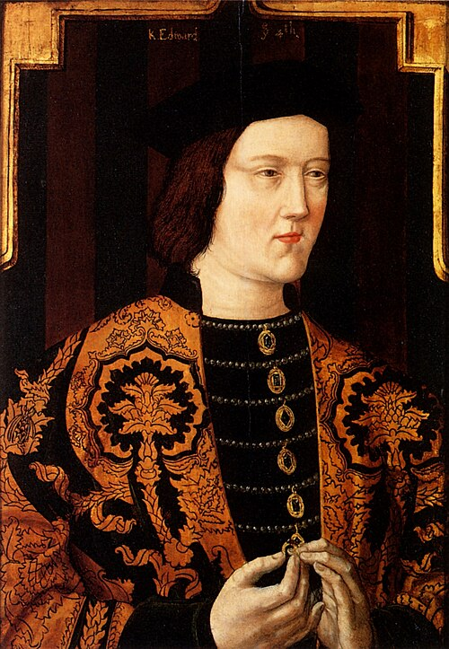

# Edward IV

- **Name**: Edward IV
- **Image**: Edward IV Plantagenet.jpg
- **Caption**: Portrait, 1520, from original made
- **Succession**: King of England
- **More Text**: (more...)
- **Reign Type**: 1st reign
- **Reign**: 4 March 1461 – 3 October 1470
- **Reign Type1**: 2nd reign
- **Reign1**: 11 April 1471 – 9 April 1483
- **Coronation1**: 28 June 1461
- **Cor Type1**: Coronation
- **Predecessor1**: Henry VI
- **Successor1**: Edward V
- **Birth Date**: 28 April 1442
- **Birth Place**: Rouen, Normandy, France
- **Death Date**: 9 April 1483 (aged 40)
- **Death Place**: Westminster, Middlesex, England
- **Burial Date**: 18 April 1483
- **Burial Place**: St George's Chapel, Windsor Castle
- **Spouse**: Elizabeth Woodville (1 May 1464–present)
- **Issue**: Elizabeth, Queen of England; Mary of York; Cecily, Viscountess Welles; Edward V, King of England; Margaret of York; Richard, Duke of York; Anne, Lady Howard; George, Duke of Bedford; Catherine, Countess of Devon; Bridget of York; Arthur, Viscount Lisle (ill.)
- **Issue Link**: #Marriage and children
- **Issue Pipe**: more...
- **House**: York
- **Father**: Richard of York, 3rd Duke of York
- **Mother**: Cecily Neville
- **Signature**: Edward IV signature.svg
