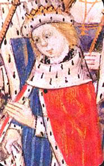

# Edward V

- **Name**: Edward V
- **Image**: King-edward-v.jpg
- **Caption**: Edward, then Prince of Wales, from a miniature in Dictes and Sayings of the Philosophers,
- **Succession**: King of England
- **More Text**: (more...)
- **Reign**: 9 April 1483 – 25 June 1483
- **Predecessor**: Edward IV
- **Regent**: Richard, Duke of Gloucester
- **Reg Type**: Lord Protector
- **Successor**: Richard III
- **Birth Date**: 2 November 1470
- **Birth Place**: Westminster, England
- **Disappeared Date**: July 1483 (aged 12)
- **Disappeared Place**: Tower of London, London, England
- **House**: York
- **Father**: Edward IV of England
- **Mother**: Elizabeth Woodville
- **Signature**: Edward V signature.svg
