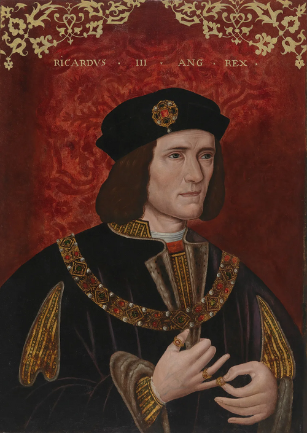

# Richard III of England

- **Name**: Richard III
- **Image**: Richard III Portrait.png
- **Alt**: Richard has pale skin, blue eyes, and wears a black hat
- **Caption**: Posthumous portrait based on contemporary original, 16th century
- **Succession**: King of England
- **More Text**: (more...)
- **Reign**: 26 June 1483 – 22 August 1485
- **Coronation**: 6 July 1483
- **Cor Type**: Coronation
- **Predecessor**: Edward V
- **Successor**: Henry VII
- **Birth Date**: 2 October 1452
- **Birth Place**: Fotheringhay Castle, Northamptonshire, England
- **Death Date**: 22 August 1485 (aged 32)
- **Death Place**: Bosworth Field, Leicestershire, England
- **Burial Date**: 25 August 1485
- **Burial Place**: Greyfriars, Leicester 26 March 2015; Leicester Cathedral
- **Spouse**: Anne Neville (1472–1485)
- **Issue**: Edward, Prince of Wales; John of Gloucester (ill.); Katherine, Countess of Pembroke (ill.)
- **Issue Link**: #Issue
- **Issue Pipe**: Detail
- **House**: York
- **Father**: Richard of York
- **Mother**: Cecily Neville
- **Signature**: Richard III signature 1.svg
