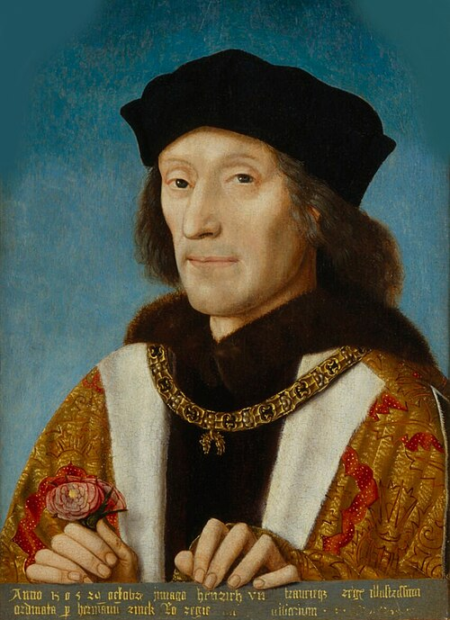

# Henry VII of England

- **Name**: Henry VII
- **Image**: Enrique VII de Inglaterra, por un artista anónimo.jpg
- **Caption**: Henry holding a rose and wearing the collar of the Order of the Golden Fleece, 1505
- **Succession**: King of England
- **More Text**: (more...)
- **Reign**: 22 August 1485 – 21 April 1509
- **Coronation**: 30 October 1485
- **Predecessor**: Richard III
- **Successor**: Henry VIII
- **Spouse**: Elizabeth of York (1486–1503)
- **Issue**: Arthur, Prince of Wales; Margaret, Queen of Scots; Henry VIII, King of England; Elizabeth of England; Mary, Queen of France; Edmund, Duke of Somerset
- **Issue Link**: #Family
- **Issue Pipe**: more...
- **House**: Tudor
- **Father**: Edmund Tudor, 1st Earl of Richmond
- **Mother**: Lady Margaret Beaufort
- **Birth Name**: Henry Tudor, Earl of Richmond
- **Birth Date**: 28 January 1457
- **Birth Place**: Pembroke Castle, Pembrokeshire, Wales
- **Death Date**: 21 April 1509 (aged 52)
- **Death Place**: Richmond Palace, Surrey, England
- **Burial Date**: 11 May 1509
- **Burial Place**: Westminster Abbey, London, England
- **Signature**: Henry VII Signature.svg
