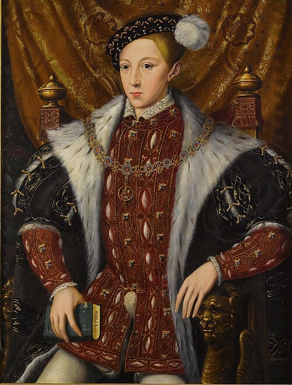

# Edward VI

- **Image**: Circle of William Scrots Edward VI of England.jpg
- **Alt**: Formal portrait in the Elizabethan style of Edward in his early teens. He has a long pointed face and a small full mouth.
- **Caption**: Portrait 1550
- **Succession**: King of England and Ireland
- **More Text**: (more ...)
- **Reign**: 28 January 1547 – 6 July 1553
- **Coronation**: 20 February 1547
- **Cor Type**: Coronation
- **Predecessor**: Henry VIII
- **Regent**: Edward Seymour, Duke of Somerset (1547–1549); John Dudley, Duke of Northumberland (1550–1553)
- **Reg Type**: Regents
- **Successor**: Jane (disputed) or Mary I
- **Birth Date**: 12 October 1537
- **Birth Place**: Hampton Court Palace, Surrey, England
- **Death Date**: 6 July 1553 (aged 15)
- **Death Place**: Palace of Placentia, Greenwich, England
- **House**: Tudor
- **Father**: Henry VIII of England
- **Mother**: Jane Seymour
- **Religion**: Protestantism
- **Burial Date**: 8 August 1553
- **Burial Place**: Westminster Abbey
- **Signature**: EdwardVI Signature.svg
