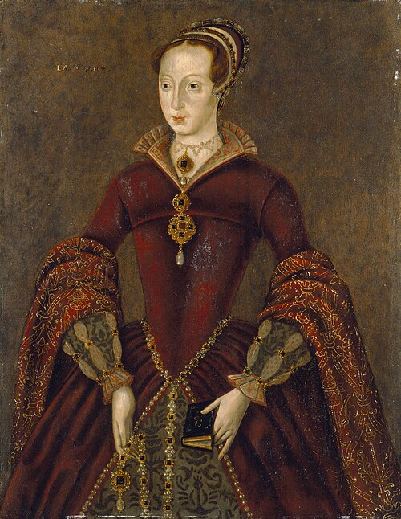

# Lady Jane Grey

- **Image**: streathamladyjayne.jpg
- **Caption**: The Streatham portrait, believed to be based on a contemporary woodcut
- **Succession**: Queen of England and Ireland
- **More Text**: (more...)
- **Reign**: 10 July 1553 – 19 July 1553
- **Predecessor**: Edward VI
- **Successor**: Mary I
- **Birth Date**: 1536 or 1537
- **Birth Place**: England
- **Death Date**: 12 February 1554 (aged 16 or 17)
- **Death Place**: Tower of London, England
- **Death Cause**: Beheading (execution)
- **Spouse**: Lord Guildford Dudley (25 May 1553–12 February 1554)
- **House**: Grey
- **Father**: Henry Grey, 1st Duke of Suffolk
- **Mother**: Lady Frances Brandon
- **Burial Place**: Church of St Peter ad Vincula, Tower of London (unconfirmed)
- **Signature**: Janegreysig.svg
- **Religion**: Protestantism
