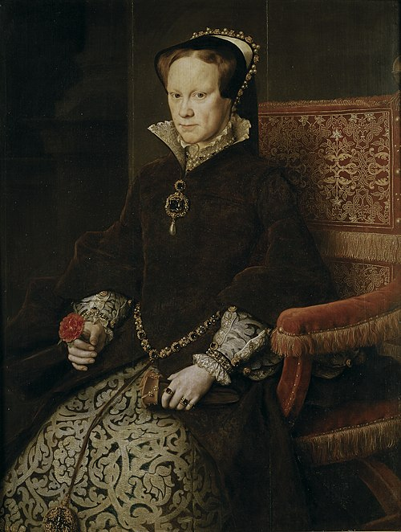

# Mary I

- **Name**: Mary I
- **Image**: Maria Tudor1.jpg
- **Caption**: Portrait by Antonis Mor, 1554
- **Alt**: Mary has a high forehead, thin lips and hair parted in the middle
- **Succession**: Queen of England and Ireland
- **More Text**: (more...)
- **Reign**: July 1553 –; 17 November 1558
- **Coronation**: 1 October 1553
- **Cor Type**: Coronation
- **Predecessor**: Jane (disputed) or Edward VI
- **Regent**: Philip (1554–1558)
- **Reg Type**: Co-monarch
- **Successor**: Elizabeth I
- **Succession1**: Queen consort of Spain
- **Reign1**: 16 January 1556 –; 17 November 1558
- **Reign Type1**: Tenure
- **Birth Date**: 18 February 1516
- **Birth Place**: Palace of Placentia, Greenwich, England
- **Death Date**: 17 November 1558 (aged 42)
- **Death Place**: St James's Palace, Westminster, England
- **Burial Date**: 14 December 1558
- **Burial Place**: Westminster Abbey, London
- **Spouse**: Philip II of Spain (25 July 1554–present)
- **House**: Tudor
- **Father**: Henry VIII of England
- **Mother**: Catherine of Aragon
- **Religion**: Catholicism
- **Signature**: Mary I Signature.svg
- **Signature Alt**: Cursive signature with the words "Marye the quene"
